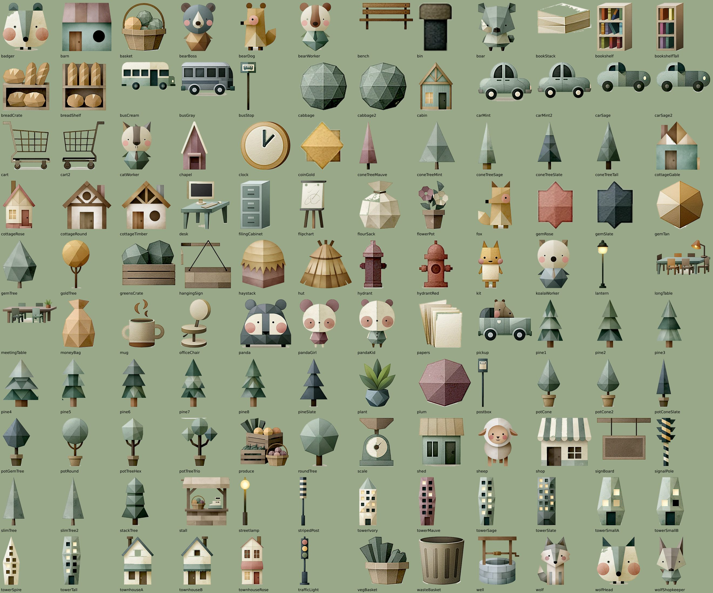

# Asset catalog

_Generated by `npm run asset-docs` from `src/assets/catalog.js` — edit the
code, not this file._

Every asset is a **sprite standee**: a piece cut straight out of the
reference sheets (`visual.png`, `city 1.png`, `city 2.png`, `office.png`,
`shop.png`) by `tools/extract-sprites.mjs`, mounted upright on the meadow
with a sliver of cardboard edge and a soft contact shadow. All
120 sprites:

## Choosing a variant

An asset type groups one or more sprites. Which one you get:

1. the type's own option, where it has one (`variant`, `animal`, `shape` —
   see the tables), or `variant: "<spriteName>"` for plain lists;
2. `color` — the variant whose paper is nearest that color (`officeTower`);
3. otherwise `seed` picks one deterministically.

Every sprite is **also an asset type by its own name** (`"type": "koalaWorker"`,
`"type": "pine4"`), for when you want one exact piece.

## Options every asset takes

| option | type | notes |
| ------ | ---- | ----- |
| `seed` | number | variant pick, mirroring, height drift, animation phase |
| `height` | number | world height of the card (width follows the sprite) |
| `flip` | bool | mirror the card (default: seeded; vehicles face their direction of travel) |
| `animation` | string | one of the type's animations, or `none` |

Legacy knobs from the old procedural library still size things sensibly:
`tiers` (pine trees), `floors` (towers). Color knobs (`wallColor`, `roofColor`
…) are ignored — the colors are printed on the paper. Old animation names
(`windSway`, `blink`, `hammer`, `crankTurn` …) are accepted silently.

## Animations

| name | what it does |
| ---- | ------------ |
| `sway` | the card rocks gently about its foot (trees, plants) |
| `idle` | breathing squash, slight rock, the odd little hop (characters) |
| `graze` | bows forward every few seconds to nibble (sheep) |
| `swing` | hanging signs sway with a faint tremble |
| `wobble` | small props give a shy wiggle now and then |
| `work` | quick rhythmic bobbing (builders) |
| `drive` | vehicles ping-pong along `path: [x1, x2]` (prop-local) at `speed`; they turn by flipping the card. Also `startAt` 0–1, `direction` ±1 |
| `cycle` | traffic light: red → green → amber halos over the printed lamps |
| `smoke` | paper puffs drift up from the chimney |

Street lamps and desk lamps always glow (a soft additive halo).

## Nature

| type | sprites | height | animations |
| ---- | ------- | ------ | ---------- |
| `pineTree` | `pine1` `pine2` `pine3` `pine4` `pine5` `pine6` `pine7` `pine8` `pineSlate` `stackTree` | 4.8 | `sway`, `none` |
| `coneTree` | `coneTreeMint` `coneTreeSlate` `coneTreeMauve` `coneTreeTall` `coneTreeSage` `slimTree` `slimTree2` `gemTree` | 4 | `sway`, `none` |
| `parkTree` | shape=`cone` → `potCone`/`potCone2` shape=`ball` → `potRound` shape=`poplar` → `potConeSlate`/`coneTreeTall` shape=`round` → `roundTree`/`goldTree` shape=`diamond` → `potGemTree`/`potTreeHex` shape=`trio` → `potTreeTrio` | 2.3–3.6 | `sway`, `none` |
| `sheep` | `sheep` | 1.9 | `idle`, `graze`, `none` |
| `lamb` | `sheep` | 1.2 | `idle`, `graze`, `none` |
| `haystack` | `haystack` | 2.5 | static |
| `hut` | `hut` | 4.1 | static |
| `well` | `well` | 2.9 | static |
| `flowerPot` | `flowerPot` | 1.1 | `sway`, `none` |
| `officePlant` | `plant` | 1.5 | `sway`, `none` |
| `cabbage` | `cabbage` `cabbage2` | 0.5 | static |
| `ball` | `cabbage` | 0.4 | `wobble`, `none` |

## Village & town buildings

| type | sprites | height | animations |
| ---- | ------- | ------ | ---------- |
| `cottage` | variant=`timber` → `cottageTimber` variant=`plain` → `cottageGable` variant=`roundWindow` → `cottageRound` variant=`rose` → `cottageRose` variant=`cabin` → `cabin` | 3.6–4.3 | static |
| `barn` | `barn` | 3.9 | static |
| `townhouse` | variant=`awning` → `townhouseRose` variant=`steep` → `chapel` variant=`timber` → `cabin` variant=`cream` → `townhouseA` variant=`cream2` → `townhouseB` | 3.8–4.6 | static |
| `schoolhouse` | `townhouseB` `townhouseA` | 4.6 | static |
| `churchTower` | `chapel` | 5.6 | static |
| `shed` | `shed` | 2.6 | static |
| `officeTower` | `towerSmallA` `towerSmallB` `towerTall` `towerSage` `towerSpire` `towerMauve` `towerSlate` `towerIvory` | 5.4–8.4 | static |
| `zevoPlant` | `towerSlate` | 7 | `smoke`, `none` |
| `shopBuilding` | `shop` | 3.8 | static |
| `marketStall` | `stall` | 3 | static |
| `vault` | `filingCabinet` | 1.9 | static |

## Street furniture

| type | sprites | height | animations |
| ---- | ------- | ------ | ---------- |
| `streetlamp` | `streetlamp` `lantern` | 3.2 | static |
| `trafficLight` | `trafficLight` | 3.3 | `cycle`, `none` |
| `bench` | `bench` | 0.95 | static |
| `hydrant` | `hydrantRed` `hydrant` | 0.75 | static |
| `busStop` | `busStop` `postbox` | 2.6 | static |
| `recyclingBin` | `bin` `wasteBasket` | 0.7 | static |
| `signalPole` | `signalPole` `stripedPost` | 3 | static |
| `trafficCone` | `stripedPost` | 1.1 | static |
| `crane` | `signalPole` | 3.4 | static |
| `scaffold` | `stripedPost` `signalPole` | 2.6 | static |
| `footballGoal` | `bench` | 0.95 | static |

## Vehicles (facing: +1 = printed pointing right)

| type | sprites | height | animations |
| ---- | ------- | ------ | ---------- |
| `car` | `carSage` `carSage2` `carMint` `carMint2` | 1.25 | `drive`, `none` |
| `bus` | `busGray` `busCream` | 1.8 | `drive`, `none` |
| `schoolBus` | `busCream` | 1.7 | `drive`, `none` |
| `garbageTruck` | `pickup` | 1.7 | `drive`, `none` |
| `excavator` | `pickup` | 1.5 | static |

## Characters

| type | sprites | height | animations |
| ---- | ------- | ------ | ---------- |
| `citizen` | `fox` `kit` `bearDog` | 1.6 | `idle`, `none` |
| `pupil` | animal=`fox` → `kit` animal=`bunny` → `pandaKid` animal=`bear` → `pandaKid` animal=`panda` → `pandaKid` | 1.35 | `idle`, `none` |
| `elder` | `badger` | 1.4 | `idle`, `none` |
| `carer` | `pandaGirl` | 1.6 | `idle`, `none` |
| `builder` | `boar` | 1.6 | `idle`, `work`, `none` |
| `officeWorker` | animal=`bear` → `bearWorker` animal=`cat` → `catWorker` animal=`hamster` → `koalaWorker` animal=`koala` → `koalaWorker` animal=`badger` → `badger` animal=`boss` → `bearBoss` | 1.6–2.3 | `idle`, `none` |
| `shopkeeper` | animal=`wolf` → `wolfShopkeeper` animal=`bear` → `boar` animal=`boar` → `boar` animal=`panda` → `pandaGirl` animal=`pandaKid` → `pandaKid` animal=`fox` → `fox` | 1.8 | `idle`, `none` |
| `mascot` | animal=`badger` → `badger` animal=`wolf` → `wolfHead` animal=`panda` → `panda` | 2.4 | `idle`, `none` |

## Office

| type | sprites | height | animations |
| ---- | ------- | ------ | ---------- |
| `desk` | `desk` | 1.85 | static |
| `schoolDesk` | `desk` | 1.25 | static |
| `officeChair` | `officeChair` | 1.3 | static |
| `bookshelf` | `bookshelf` `bookshelfTall` | 2.2 | static |
| `whiteboard` | `flipchart` | 2.3 | static |
| `blackboard` | `flipchart` | 1.8 | static |
| `meetingTable` | `meetingTable` `longTable` | 1.45–1.9 | static |
| `table` | `meetingTable` | 1.45 | static |
| `filingCabinet` | `filingCabinet` | 1.9 | static |
| `deskLamp` | `lantern` | 1 | static |
| `mug` | `mug` | 0.55 | static |
| `paperStack` | `papers` `bookStack` | 0.4–0.6 | static |
| `ledger` | `bookStack` | 0.4 | static |
| `wasteBasket` | `wasteBasket` `bin` | 0.6 | static |
| `clock` | `clock` | 0.8 | static |

## Shop & money

| type | sprites | height | animations |
| ---- | ------- | ------ | ---------- |
| `crate` | `greensCrate` `produce` | 0.9–1.4 | static |
| `basket` | `basket` `vegBasket` | 0.75 | static |
| `flourSack` | `flourSack` | 1.6 | static |
| `breadShelf` | `breadShelf` `breadCrate` | 1.7 | static |
| `shopSign` | `hangingSign` `signBoard` | 1.7 | `swing`, `none` |
| `shoppingCart` | `cart` `cart2` | 1.2 | static |
| `pram` | `cart2` | 1.2 | static |
| `scale` | `scale` | 1 | `wobble`, `none` |
| `moneyBag` | `moneyBag` | 1 | static |
| `coinStack` | `coinGold` | 0.75 | `wobble`, `none` |
| `piggyBank` | `gemRose` | 0.9 | `wobble`, `none` |
| `gem` | `coinGold` `gemRose` `gemSlate` `gemTan` `plum` | 0.8 | static |

## Drawn in code

| type | options | notes |
| ---- | ------- | ----- |
| `fence` | `length` (default 5), `seed` | picket fence painted in the sheet's style (mixed wood tones, pointed and square posts, half-shaded) |
| `mountainBackdrop` | `width`, `height`, `seed` | three layers of faceted paper ridges, light/shaded halves like the sheet's trees; place on a deep layer |
| `wolf` | `flip`, `animation: idle\|walk\|sit\|none` | a second wolf; the hero is added automatically |

## Adding sprites

1. Put a new reference sheet (white background) in the repo root and add it
   to `sheets` in `tools/sprites.config.js`.
2. Add one line per piece: `[name, sheet, [x0, y0, x1, y1]]` — the rect in
   the sheet's 2000-px-wide preview space. Options: `maxH`, `tight` (the
   piece's own paper is nearly white), `hull` (fill nibbled convex rims),
   `hardShadow` (grainy shadows), `keepAll` (keep detached details).
3. `npm run sprites` — cuts `src/sprites/*.webp`, updates the manifest, the
   contact sheet and this file. Check `docs/assets/sprites.jpg`.
4. The sprite is now usable by name; to group it into a type, add it to
   `TYPES` in `src/assets/catalog.js`.
